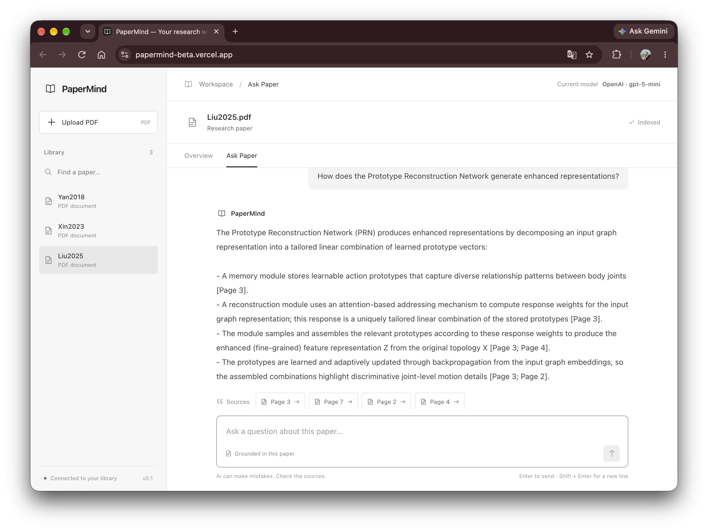
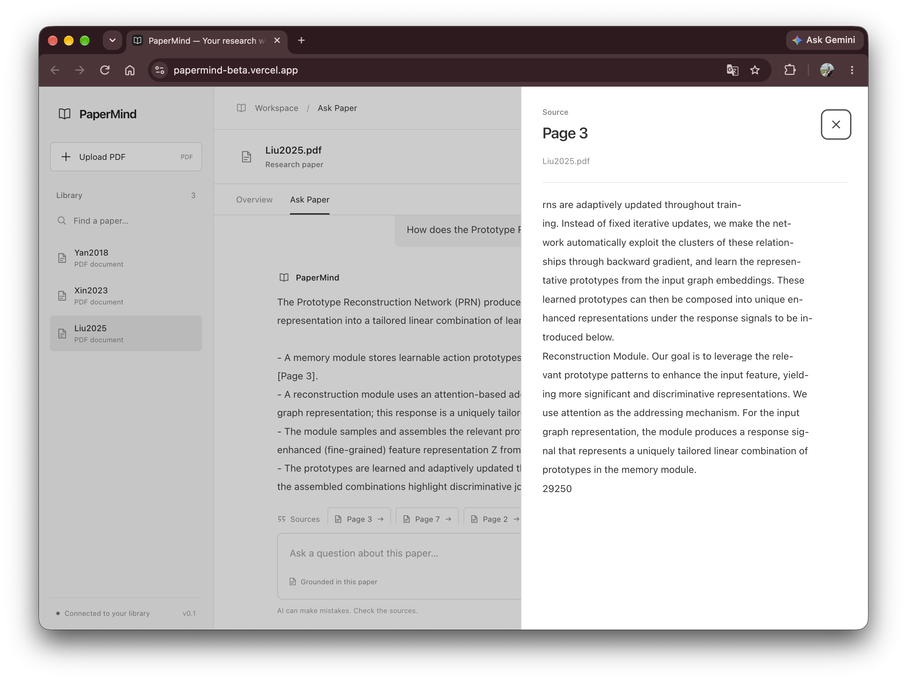
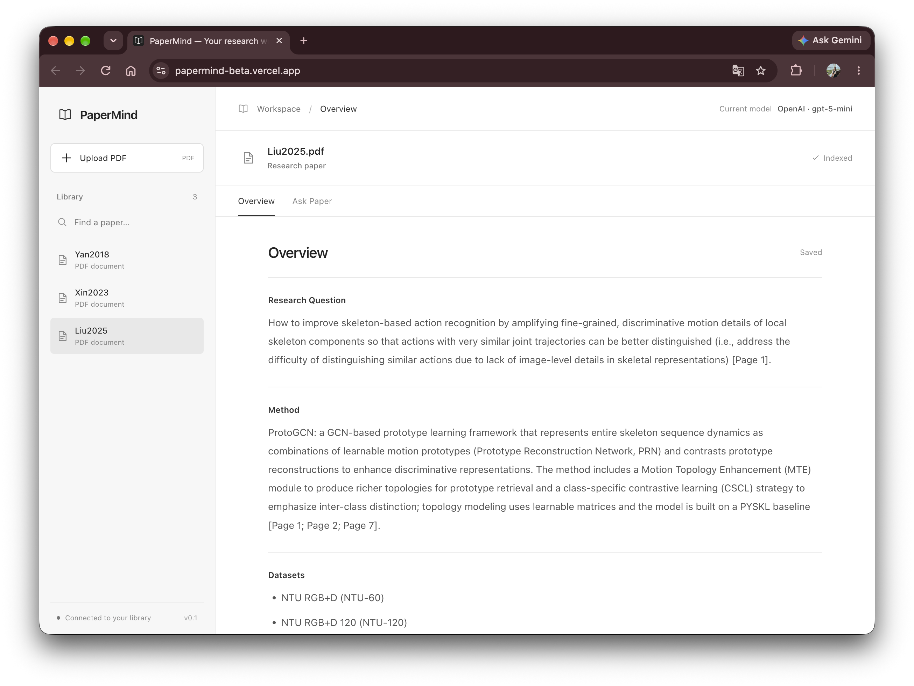

# PaperMind — Research Paper RAG

PaperMind is a full-stack Retrieval-Augmented Generation (RAG) application for exploring and understanding research papers.

Users can upload PDF papers, generate structured paper overviews, ask natural-language questions, and inspect the exact source passages used to generate each answer. The system combines semantic retrieval with page-level citations to keep answers grounded in the uploaded paper.

## Live Demo

https://papermind-beta.vercel.app

## Demo

### Ask questions with grounded, page-level citations



PaperMind retrieves relevant passages from the selected paper and generates answers grounded in the retrieved evidence, with page-level citations.

### Inspect the evidence behind each answer



Each citation can be opened to inspect the exact source passage used as supporting evidence.

### Generate a structured paper overview



PaperMind generates a structured overview covering the research question, method, datasets, results, and limitations using retrieved evidence from the paper.

## Features

- **PDF ingestion** — Upload and index research papers directly from PDF files.
- **Semantic retrieval** — Retrieve relevant passages using vector similarity search.
- **Grounded Q&A** — Generate answers using only retrieved paper context.
- **Page-level citations** — Answers include citations to supporting PDF pages.
- **Source Viewer** — Inspect the exact retrieved passage behind a citation.
- **Paper Overview** — Generate a structured overview of a paper from retrieved evidence.
- **Duplicate detection** — SHA-256 file hashing prevents the same paper from being indexed twice.
- **Paper management** — Browse and delete indexed papers and their associated chunks.
- **RAG evaluation** — Includes a manually annotated benchmark for both retrieval and generation quality.

## Architecture

```text
                         PaperMind
                             │
                    React + TypeScript
                             │
                          FastAPI
                             │
             ┌───────────────┴───────────────┐
             │                               │
        PDF Ingestion                    Ask Paper
             │                               │
          PyMuPDF                         Question
             │                               │
       Page Extraction               Query Embedding
             │                               │
         Chunking                           │
             │                               │
      text-embedding-3-small                 │
             │                               │
             └──────────► PostgreSQL + pgvector
                                             │
                                      Top-5 Retrieval
                                             │
                                        gpt-5-mini
                                             │
                                  Grounded Answer + Citations
```

### RAG Pipeline

When a paper is uploaded:

1. The PDF is parsed with **PyMuPDF**.
2. Text is extracted while preserving page numbers.
3. Each page is divided into smaller text chunks.
4. Chunks are embedded using OpenAI **`text-embedding-3-small`**.
5. Embeddings and chunk metadata are stored in **PostgreSQL with pgvector**.

When a user asks a question:

1. The question is converted into an embedding.
2. PostgreSQL/pgvector performs cosine-similarity search.
3. The **Top-5** most relevant chunks are retrieved.
4. Retrieved passages are provided to **`gpt-5-mini`** as context.
5. The model generates a grounded answer with page-level citations.
6. Users can open a citation to inspect the underlying source passage.

## Paper Overview

PaperMind can also generate a structured overview of an indexed paper.

The overview pipeline combines:

- early-document chunks
- method-focused semantic retrieval
- dataset and experiment retrieval
- result and performance retrieval
- limitation and future-work retrieval

Retrieved chunks are deduplicated and ordered by document position before being passed to the language model.

Generated overviews are cached in PostgreSQL so repeated requests do not require another model call.

## RAG Evaluation

The RAG pipeline was evaluated on a small manually annotated benchmark consisting of:

- **3 research papers**
- **5 questions per paper**
- **15 questions total**

All papers are from the skeleton-based action recognition domain, while representing different document structures: two method papers and one survey paper.

This setup keeps the technical domain relatively consistent while testing retrieval across different types of research papers.

### Retrieval Evaluation

Ground-truth evidence pages were manually identified for each question.

A retrieval was counted as a hit when at least one ground-truth evidence page appeared among the retrieved chunks.

| Metric | Result |
|---|---:|
| Page-level Hit@1 | **73.3% (11/15)** |
| Page-level Hit@3 | **93.3% (14/15)** |
| Page-level Hit@5 | **100% (15/15)** |

Top-5 retrieval is used by the application and achieved 100% page-level Hit@5 on this evaluation set.

### Generation Evaluation

The same 15 questions were passed through the complete production RAG pipeline.

Generated answers were manually evaluated using three binary criteria:

- **Answer Correctness** — whether the answer correctly and sufficiently addresses the question.
- **Groundedness** — whether substantive claims are supported by the retrieved context.
- **Citation Correctness** — whether cited pages support the associated claims.

| Metric | Result |
|---|---:|
| Answer Correctness | **86.7% (13/15)** |
| Groundedness | **100% (15/15)** |
| Citation Correctness | **100% (15/15)** |

Two answers were judged incomplete despite relevant evidence being available, illustrating a generation-stage limitation rather than a retrieval failure.

The evaluation scripts and benchmark data are available in [`evaluation/`](evaluation/).

## Tech Stack

### Backend

- Python
- FastAPI
- OpenAI API
- PostgreSQL
- pgvector
- psycopg
- PyMuPDF
- Pydantic
- Uvicorn

### Frontend

- React
- TypeScript
- Vite

### AI / Retrieval

- **Generation:** `gpt-5-mini`
- **Embeddings:** `text-embedding-3-small`
- **Retrieval:** cosine similarity over pgvector embeddings
- **Retrieval depth:** Top-5 chunks

### Infrastructure

- Docker
- Google Cloud Run
- Google Cloud Build
- Google Artifact Registry
- Google Cloud Secret Manager
- Supabase
- Vercel

## Deployment

PaperMind is deployed as a full-stack web application:

- **Frontend:** Vercel
- **Backend:** Google Cloud Run
- **Containerization:** Docker
- **Container Registry:** Google Artifact Registry
- **Database / Vector Store:** Supabase PostgreSQL + pgvector
- **Backend CI/CD:** Google Cloud Build
- **Secrets:** Google Cloud Secret Manager

### CI/CD

Backend deployments are automated through Google Cloud Build.

```text
Push to main
    │
    ├── frontend/** ──► Vercel ──► Frontend deployment
    │
    └── backend/** ───► Cloud Build
                            │
                         Docker build
                            │
                     Artifact Registry
                            │
                         Cloud Run
                            │
                     Backend deployment
```

Changes to the frontend are automatically deployed by Vercel, while backend changes trigger a container build and Cloud Run deployment through Google Cloud Build.

## Project Structure

```text
PaperMind/
├── backend/
│   ├── app/
│   │   ├── ask_service.py
│   │   ├── chunking.py
│   │   ├── database.py
│   │   ├── embedding.py
│   │   ├── main.py
│   │   ├── overview.py
│   │   ├── overview_repository.py
│   │   ├── overview_retrieval.py
│   │   ├── overview_service.py
│   │   ├── pdf_utils.py
│   │   ├── rag.py
│   │   └── repository.py
│   ├── migrations/
│   ├── tests/
│   ├── Dockerfile
│   └── requirements.txt
│
├── frontend/
│   ├── src/
│   │   ├── App.tsx
│   │   ├── PaperOverview.tsx
│   │   └── ...
│   └── package.json
│
├── evaluation/
│   ├── questions.json
│   ├── evaluate_retrieval.py
│   ├── evaluate_generation.py
│   ├── results.json
│   └── generation_results.json
│
├── docs/
│   ├── ask-paper.png
│   ├── source-viewer.png
│   └── paper-overview.png
│
├── cloudbuild.yaml
└── README.md
```

## Getting Started

### 1. Clone the repository

```bash
git clone https://github.com/ninni13/PaperMind.git
cd PaperMind
```

### 2. Backend setup

Create and activate a virtual environment:

```bash
cd backend

python -m venv venv
source venv/bin/activate
```

Install dependencies:

```bash
pip install -r requirements.txt
```

Create a `.env` file containing the required environment variables:

```env
OPENAI_API_KEY=your_openai_api_key
DATABASE_URL=your_postgresql_connection_string

# Optional — defaults to gpt-5-mini
OVERVIEW_MODEL=gpt-5-mini
```

Start the FastAPI server:

```bash
uvicorn app.main:app --reload
```

The backend will run at:

```text
http://127.0.0.1:8000
```

FastAPI API documentation is available at:

```text
http://127.0.0.1:8000/docs
```

### 3. Frontend setup

Open another terminal:

```bash
cd frontend
npm install
```

Create a `frontend/.env` file:

```env
VITE_API_URL=http://127.0.0.1:8000
```

Start the development server:

```bash
npm run dev
```

The development server will typically run at:

```text
http://localhost:5173
```

## Evaluation

Run retrieval evaluation from the project root:

```bash
python evaluation/evaluate_retrieval.py
```

Run generation evaluation:

```bash
python evaluation/evaluate_generation.py
```

Resume an interrupted generation evaluation:

```bash
python evaluation/evaluate_generation.py --resume
```

Re-parse citations from existing generated answers without calling the OpenAI API:

```bash
python evaluation/evaluate_generation.py --reparse-citations
```

Summarize manually reviewed generation results:

```bash
python evaluation/evaluate_generation.py --summary
```

## Testing

The current test suite contains **28 passing tests**, covering core backend behavior, overview generation, retrieval, API behavior, and evaluation utilities.

Run the backend tests with:

```bash
cd backend
pytest
```

## Limitations

The current version has several limitations:

- The evaluation benchmark is intentionally small and domain-specific, so the reported metrics should not be interpreted as general performance across all research papers.
- Retrieval operates on fixed text chunks and does not explicitly model document sections.
- Complex tables, figures, equations, and image-based PDF content are not handled as structured multimodal evidence.
- Generation quality still depends on whether the model fully uses the retrieved evidence.
- The system currently performs retrieval within a single selected paper rather than reasoning across a large multi-paper collection.

## Future Work

Potential extensions include:

- hybrid dense + keyword retrieval
- reranking retrieved chunks before generation
- automatic section-aware document parsing
- multimodal retrieval for figures and tables
- multi-paper question answering
- larger evaluation datasets and automated RAG evaluation
- retrieval and generation observability

## Disclaimer

The evaluation results reported above are based on a small, manually annotated 15-question benchmark and are intended to document the behavior of this implementation rather than claim general RAG performance.